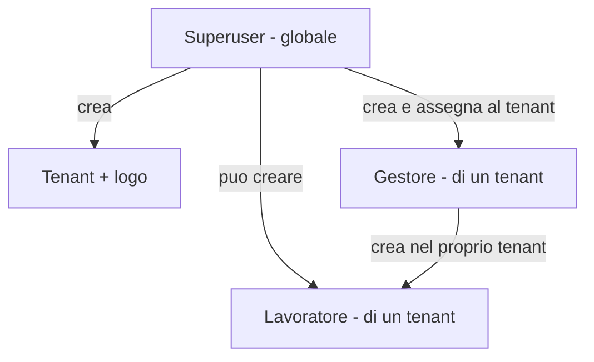
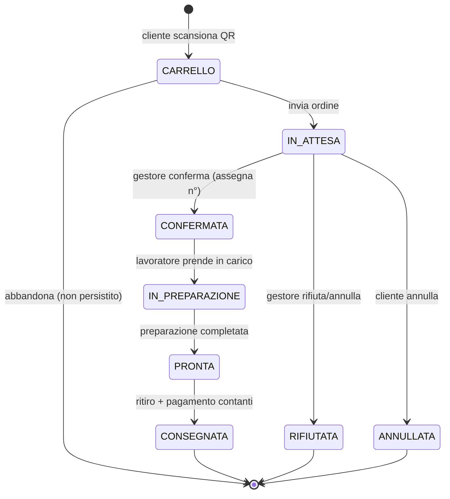

# Specifica funzionale — App comande pub / street-food (multitenant)

Documento di riferimento funzionale. Accompagna `CLAUDE.md` (decisioni tecniche) e
`backlog.md` (attività).

## 1. Obiettivo

Permettere a un cliente di ordinare scansionando un QR code, senza registrazione, e
al locale di gestire le comande tramite due code (gestore e lavoratore), con
pagamento in contanti alla consegna. L'applicazione è **multitenant**: una singola
app serve più locali (tenant), ciascuno con menu, QR, comande e utenze isolati.

## 2. Attori e capacità

Non esiste registrazione: le utenze staff sono create dall'alto verso il basso. Il
cliente è anonimo e legato a un tenant tramite il QR.

| Attore     | Ambito              | Capacità                                                                                                                                                                                                    |
| ---------- | ------------------- | ----------------------------------------------------------------------------------------------------------------------------------------------------------------------------------------------------------- |
| Superuser  | Globale             | Crea tenant; crea gestori e li assegna a un tenant; crea lavoratori; assegna un logo a un tenant                                                                                                            |
| Gestore    | Un tenant           | Crea utenze lavoratore del proprio tenant; configura il menu (CRUD, quantità, disponibilità runtime); genera N QR etichettati; vede il riepilogo giornaliero/mensile; conferma o annulla/rifiuta le comande |
| Lavoratore | Un tenant           | Accede e vede solo le comande confermate dal gestore; le prende in carico, le marca pronte/consegnate                                                                                                       |
| Cliente    | Anonimo, per tenant | Scansiona il QR; compone l'ordine con nickname; riceve riepilogo; traccia la propria comanda                                                                                                                |

Sia superuser sia gestore possono creare lavoratori: il superuser cross-tenant, il
gestore solo nel proprio tenant. **La creazione dei gestori è riservata al
superuser** (il gestore non crea altri gestori). Il superuser iniziale è
provisionato via seed.

## 3. Multitenancy

- Una sola applicazione e un solo database per più tenant.
- Ogni entità operativa porta `tenantId`; **ogni query lato server è scopata sul
  tenant** e i dati di tenant diversi non si incrociano.
- Risoluzione del tenant:
  - cliente: dal `qrToken` → `QrSource` → `tenantId`;
  - staff: dalla sessione (`StaffUser.tenantId`);
  - superuser: globale, sceglie il tenant da amministrare.
- Ogni tenant ha un **logo** proprio, mostrato nelle pagine cliente e staff del
  tenant.
- MVP: tenant non in URL pubblico (deriva da QR/sessione). Sottodominio o dominio
  dedicato per tenant sono opzione futura.

## 4. Provisioning delle utenze (gerarchia)



Cliente: nessuna utenza, accesso anonimo via QR del tenant.

## 5. Flussi

### 5.1 Setup (una tantum, per nuovo locale)

1. Il superuser crea il tenant e ne imposta il logo.
2. Il superuser crea il gestore e lo assegna al tenant.
3. Il gestore accede, configura il menu, crea i propri lavoratori e genera i QR.

### 5.2 Flusso operativo (happy path)

1. Il cliente scansiona un QR → si apre il menu del tenant, filtrato sugli elementi
   disponibili.
2. Il cliente compone il carrello, inserisce un nickname e invia l'ordine.
3. Il cliente riceve un riepilogo e un link/token di tracciamento.
4. La comanda entra nella coda virtuale del gestore (`IN_ATTESA`).
5. Il gestore conferma: viene assegnato un numero progressivo (per tenant) e la
   comanda passa alla coda dei lavoratori (`CONFERMATA`). In alternativa il gestore
   annulla/rifiuta la comanda.
6. Un lavoratore la prende in carico (`IN_PREPARAZIONE`), la prepara e la marca
   pronta (`PRONTA`).
7. La comanda viene consegnata e pagata in contanti (`CONSEGNATA`).
8. Il gestore consulta il riepilogo giornaliero/mensile del proprio tenant.

## 6. Macchina a stati della comanda



| Da              | A               | Trigger                             | Attore             |
| --------------- | --------------- | ----------------------------------- | ------------------ |
| CARRELLO        | IN_ATTESA       | invio ordine                        | cliente            |
| IN_ATTESA       | CONFERMATA      | conferma + assegnazione numero      | gestore            |
| IN_ATTESA       | RIFIUTATA       | rifiuto/annullamento (es. esaurito) | gestore            |
| IN_ATTESA       | ANNULLATA       | annullamento prima della conferma   | cliente            |
| CONFERMATA      | IN_PREPARAZIONE | presa in carico                     | lavoratore         |
| IN_PREPARAZIONE | PRONTA          | preparazione conclusa               | lavoratore         |
| PRONTA          | CONSEGNATA      | consegna e incasso contanti         | lavoratore/gestore |

Note: `IN_PREPARAZIONE` gestisce più lavoratori sulla stessa coda (presa in carico =
blocco agli altri). Ogni transizione è verificata anche sul tenant dell'attore.

## 7. Modello dati (indicativo, MongoDB)

```jsonc
// tenants
{
  "_id": "...",
  "name": "Pub del Centro",
  "logoUrl": "https://.../logo.png",
  "active": true,
  "settings": {}
}

// staffUsers
{
  "_id": "...",
  "role": "gestore",         // superuser | gestore | lavoratore
  "tenantId": "...",          // null per superuser (globale)
  "username": "...",
  "passwordHash": "..."
}

// menuItems
{
  "_id": "...",
  "tenantId": "...",
  "name": "Panino pulled pork",
  "description": "...",
  "price": 750,               // in centesimi, mai float
  "category": "panini",
  "available": true,          // toggle runtime del gestore
  "stock": 30,                // opzionale; null = illimitato
  "imageUrl": null,
  "allergens": []             // futuro
}

// qrSources
{
  "_id": "...",
  "tenantId": "...",
  "token": "opaco-non-sequenziale",
  "label": "Tavolo 5",
  "type": "table",            // table | takeaway | cart | delivery (futuro)
  "active": true
}

// orders
{
  "_id": "...",
  "tenantId": "...",
  "trackToken": "opaco",
  "nickname": "Marco",
  "qrSource": { "id": "...", "label": "Tavolo 5" },
  "items": [
    { "menuItemId": "...", "name": "Panino pulled pork",
      "qty": 2, "unitPrice": 750, "notes": "senza cipolla" }
  ],
  "total": 1500,              // ricalcolato lato server
  "status": "IN_ATTESA",
  "number": null,             // assegnato alla conferma, progressivo per tenant
  "rejectionReason": null,
  "createdAt": "...",
  "confirmedAt": null,
  "readyAt": null,
  "deliveredAt": null
}

// counters  (numerazione atomica giornaliera, per tenant)
{ "_id": "TENANTID-order-number-2026-06-05", "seq": 42 }
```

Il riepilogo giornaliero/mensile del gestore si ricava aggregando gli `orders` del
tenant per intervallo di date (numero comande, incasso stimato, voci più vendute).

## 8. Buchi funzionali individuati

1. **Bootstrap del superuser**: il primo superuser va creato via seed/provisioning
   fuori dall'app; nessuna registrazione pubblica.
2. **Risoluzione e isolamento del tenant**: ogni query scopata per `tenantId` preso
   da sessione (staff) o QR/ordine (cliente), mai dal client. Servono test di
   isolamento.
3. **Autenticazione staff a tre ruoli**: superuser, gestore, lavoratore.
4. **Tracciamento lato cliente**: `trackToken` opaco e pagina di stato (il cliente
   non ha login).
5. **Aggiornamenti realtime delle code** (SSE o polling in MVP).
6. **Rifiuto/annullamento del gestore** con motivazione e notifica al cliente.
7. **Annullamento del cliente** solo finché `IN_ATTESA`.
8. **Concorrenza sulla disponibilità**: controllo/decremento stock atomico alla
   conferma.
9. **Numerazione comande**: progressiva, univoca, atomica, **per tenant** e
   **azzerata ogni giorno**.
10. **Assegnazione multi-lavoratore**: risolta con `IN_PREPARAZIONE` (claim).
11. **Idempotenza dell'invio** ordine.
12. **Orari di servizio**: blocco/pausa ordini quando il locale è chiuso.
13. **Validazione e fonte di verità**: prezzi, totale e tenant ricalcolati lato
    server.
14. **Anti-abuso QR pubblico**: rate limiting.

## 9. Migliorie suggerite (oltre l'MVP)

- **Tempo di attesa stimato** per il cliente.
- **Notifica sonora/visiva** lato gestore e lavoratore all'arrivo di nuove comande.
- **Note e varianti per piatto**, allergeni e foto nel menu.
- **Categorie di menu** ordinabili.
- **Report avanzati** oltre il riepilogo base (trend, confronto periodi).
- **Stampa comanda** (già prevista): progettare per ESC/POS; MVP da browser.
- **Pagamento in app** (già previsto): predisporre stato/integrazione.
- **Consegna a domicilio** (prevista nei next step): modalità alternativa a
  tavolo/asporto in cui la comanda viene consegnata all'indirizzo del cliente.
  Implicazioni da prevedere nel modello, senza implementarla ora:
  - tipo sorgente/ordine `delivery` accanto a `table`/`takeaway`/`cart`;
  - raccolta di **indirizzo** e **contatto** del cliente (per il domicilio il solo
    nickname non basta);
  - ramo della macchina a stati per la consegna:
    `PRONTA → IN_CONSEGNA → CONSEGNATA`, distinto dal ritiro al banco;
  - eventuale **costo/zona di consegna** e gestione di chi consegna (riuso del
    ruolo lavoratore o nuovo ruolo fattorino);
  - pagamento alla consegna (contanti) coerente con l'attuale flusso.
- **Branding esteso per tenant** (oltre il logo: colori, nome visualizzato).
- **Sottodominio/dominio dedicato** per tenant.
- **GDPR / privacy**: solo nickname, retention breve delle comande chiuse.
- **Accessibilità**: contrasto, tastiera, ARIA sui componenti Bootstrap.

## 10. Decisioni confermate e domande aperte

Confermato dal committente:

- La numerazione delle comande si **azzera ogni giorno**, in modo progressivo e per
  tenant.
- La **creazione dei gestori è prerogativa esclusiva del superuser**; il gestore crea
  solo lavoratori del proprio tenant.

Domande ancora aperte:

- Esiste più di un lavoratore in contemporanea? (incide su `IN_PREPARAZIONE`)
- Il cliente può modificare/annullare l'ordine dopo l'invio?
- Vincoli sull'hardware di stampa (modello stampante, ESC/POS)?
